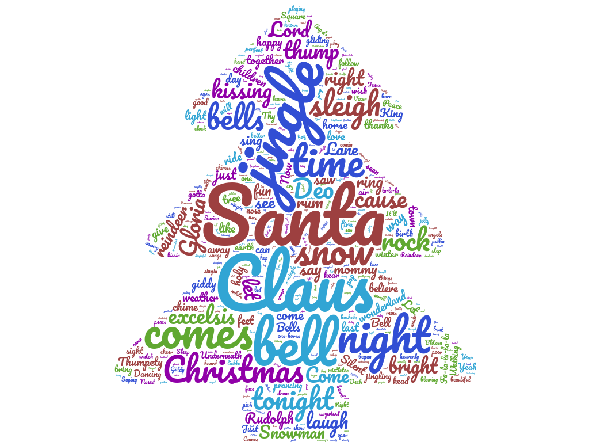
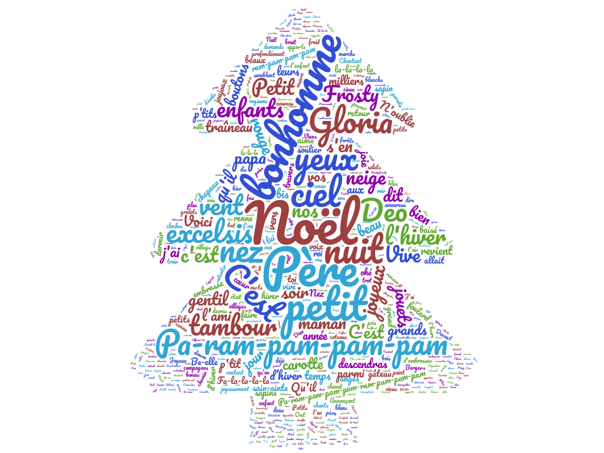

--- 
title: "Christmas carols: multi-lingual, with chords, analyzed using Data Science"   
  #author: "IVIM"
documentclass: book
site: bookdown::bookdown_site
#subtitle: Chansons de Noël avec accords
description: Christmas songs  for multi-lingual families, with chords
#subtitle: Multi-lingual, with chords, analyzed using Data Science 
---

<!-- # Les 30 meilleures chansons de Noël {-} -->

  <!-- Also available as [pdf] and [epub] -->
  
#  Merry Christmas, tout le monde ! {-} 


<!-- Songs are roughly ordered to according to the following classifications: -->

<!-- - Easy tunes (bilingual) -->
<!-- - Rock tunes  -->
<!-- - Mellow tunes  -->
<!-- - New tunes   -->
<!-- - New Year songs -->
<!-- - Other winter songs -->


<!--   -->


<!-- ```{r, out.width='50%', fig.align='center', echo=FALSE} -->
<!-- knitr::include_graphics("cover-xmas.jpg") -->
<!-- ``` -->

<!-- {r, echo=FALSE,out.width="49%", out.height="20%",fig.cap="caption",fig.show='hold',fig.align='center'}  -->

```{r, echo=FALSE,out.width="49%", out.height="20%",fig.cap="Data  representation of Christmas songs in this booklet: English vs. French versions of the same songs ",fig.show='hold',fig.align='center'} 

knitr::include_graphics(c("png/noel-cloud-eng-col1.png","png/noel-cloud-fre-col.png"))

``` 


### Credits {-}


This book is built using bookdown. The lyrics is analyzed using R. The source is at github. Contributions and corrections are welcome.

Pdf file is generated  [https://ebook.online-convert.com/convert-to-pdf](here)
